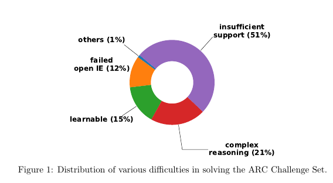

## Notes on the paper "KG2: Learning to Reason Science Exam Questions with Contextual Knowledge Graph Embeddings"

[Link to paper](https://arxiv.org/pdf/1805.12393.pdf)

|Method | Test Scores|
|:-----:|:----------:|
|KG2 | 31.70|
|TableILP | 26.97|
|BiDAF | 26.54| 
|DGEM-OpenIE | 26.41 |
|			 |(27.11 using some propiretry parser) | 
|Guess-all / Random | 25.02|
|DecompAttn | 24.34|
|TupleInference | 23.83|
|IR-Google | 21.58|
|IR-ARC | 20.26|

- Using Google Search API to slect the answer option with most hits doesn't even crosses the Guess-all/Random baseline. 
- TODO: Does this mean collecting more senetences won't help?
- Hypothesis *hi = question + ai*
- Knowledge Graph
- Graph Embedding
- Graph Ranking Problem?

### Approach

&nbsp; **1. Generating Hypothesis**

- hi : ith hypothesis
- qi : ith question
- cij : jth option for ith question
- ai : correct option for ith question 
- hi = qi + cij
- automatically generate hypothesis by substituting wh-words in questions with candidate option

&nbsp; **2. Searching Potential Supports**

- ElasticSearch: hypothesis as query to corpus
- Top 20 (filtered clean) sentences are used as potential support sentence.

&nbsp; **3. Constructing Knowledge Graphs**

- Open IE to extract triples from each support sentence.
- Triples: T(subj, predicate, obj)
- Collect them to construct a contextual knowledge graph.
- For e.g. **he** <-subj- **play** -ball-> **ball*
- Create Hypothesis Graph (Ghypo) and Support Graph(Gsupp)

&nbsp; **4. TODO: Learning with graph embeddings?**

- Choosing right answer becomes a Graph Ranking Problem *How?*
- Graph Scoring Function f: Ghypo X Gsupp --> R should give highest score to correct pair?
- Point wise ranking objective?
- Read Graph Embeddings

### Analysis

- Estimated upper bound: Correctly answer all learnable questions, and randomly guess others: **36.25%**. If this is the case curating more data might help.
